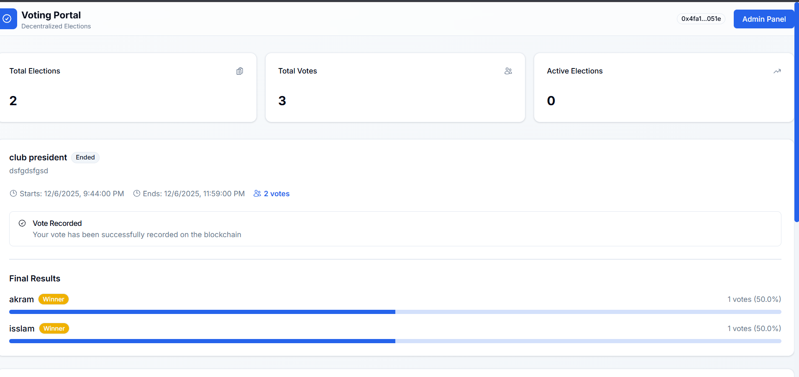

# Decentralized Voting System (DApp)

A **secure, transparent, and decentralized voting platform** built using **Blockchain**, **Solidity**, and **Next.js**.  
This project enables tamper-proof elections where votes are recorded immutably on the blockchain and results are publicly verifiable.

---

## Live Demo

🔗 **Deployed Application:**  
https://voting-dapp-iota-dusky.vercel.app/

> Note: MetaMask is required to interact with the application.

---

## Project Preview

---

## Project Concept

The **Decentralized Voting System** is a blockchain-based application designed to ensure:

- Transparency
- Integrity
- Fairness
- Trustless governance

Votes are stored on-chain, preventing manipulation and ensuring democratic decision-making without relying on a central authority.

---

## Use Cases

This DApp can be used for:

- Scientific club elections
- Course polls and project evaluations
- Competition judging
- Student organizations and communities
- Any transparent decision-making process

---

## Key Features

### Smart Contract (Solidity)

- Admin-controlled election creation
- Time-based election lifecycle (start and end)
- Voter eligibility registration
- One-person-one-vote enforcement
- Immutable vote storage
- Automatic vote counting
- Public result verification
- Secure admin transfer

### User Features

- Wallet-based authentication (MetaMask)
- Anonymous vote submission
- Real-time election status
- Vote confirmation on the blockchain
- Transparent final results with percentages

### Admin Features

- Secure admin authentication via wallet signature
- Election creation with candidates and time range
- Eligible voter registration (batch support)
- Manual election termination
- Access to election data and results

---

## Learning Outcomes

By building this project, you will understand:

- How blockchain ensures transparency and immutability
- How smart contracts enforce trustless rules
- How to integrate Solidity smart contracts with a modern frontend
- How decentralized governance systems operate
- Secure authentication using cryptographic wallet signatures

---

## System Architecture

Frontend (Next.js + TypeScript)
↓
Web3 Context (Wallet & Contract Interaction)
↓
Ethereum Smart Contract (Solidity)
↓
Blockchain (Immutable Storage)

---

## Smart Contract Overview

**Contract:** `VotingSystem.sol`

### Core Components

- `Election` data structure
- Election lifecycle management
- Voter eligibility tracking
- Candidate-based vote counting
- Event emission for transparency

### Key Functions

- `createElection()`
- `registerVoters()`
- `vote()`
- `endElection()`
- `getElection()`
- `getResults()`
- `isEligibleVoter()`
- `hasVoted()`

---

## Frontend Stack

- **Next.js (App Router)**
- **TypeScript**
- **Web3.js**
- **Tailwind CSS**
- **shadcn/ui**
- **MetaMask Integration**

---
